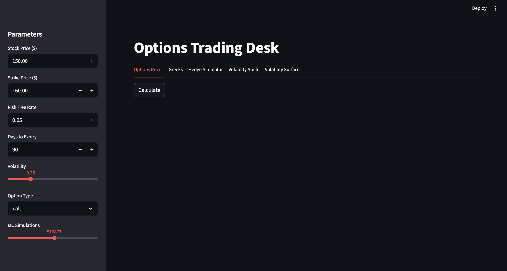
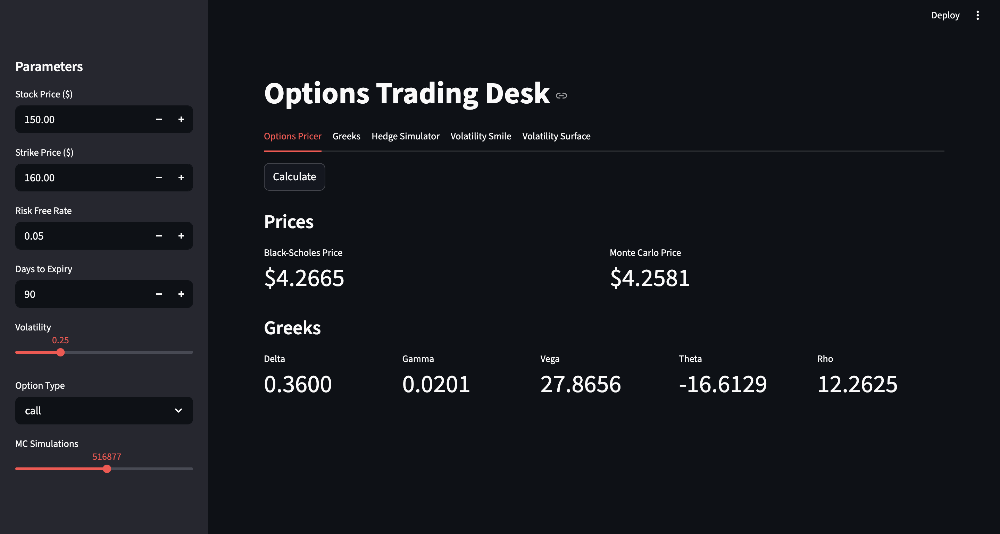
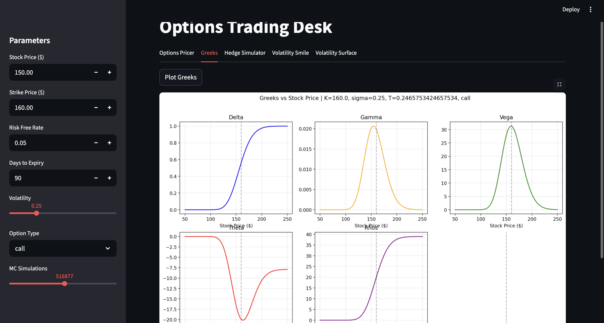
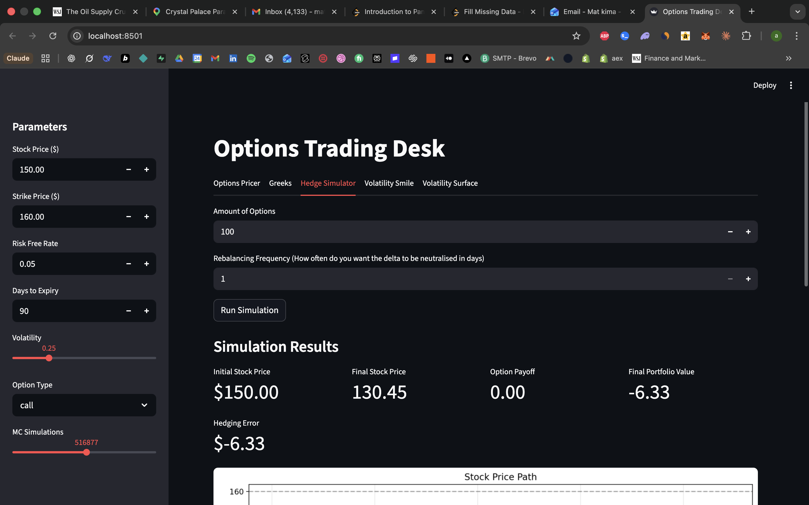
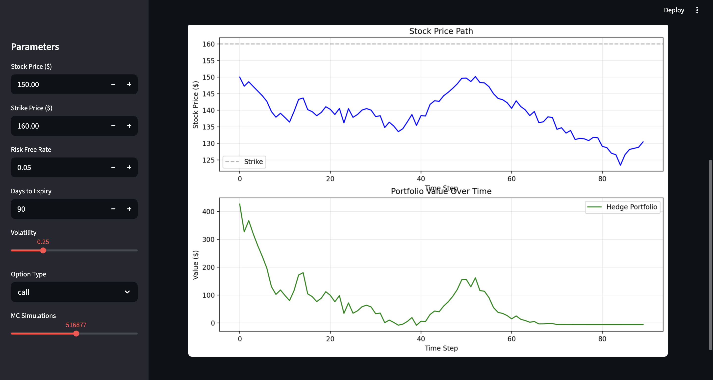
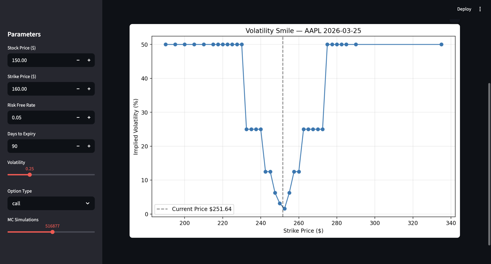

# OPTIONS TRADING DESK (BLACK-SCHOLES)

A quantitative options pricing and risk management tool built on the Black-Scholes framework.

The tool allows the user to price European options using Black-Scholes and Monte Carlo simulation, visualise Greek sensitivities, simulate a dynamic delta hedging strategy, and analyse the implied volatility surface using real market data.

## Features

**Options Pricer** — Prices European calls and puts using Black-Scholes and Monte Carlo. Displays all five Greeks.

**Greeks Visualiser** — Plots Delta, Gamma, Vega, Theta and Rho across a range of stock prices showing how option sensitivity changes with moneyness.

**Delta Hedge Simulator** — Simulates dynamic delta hedging of a sold option position over the life of the contract using GBM generated stock paths. Rebalancing frequency is configurable — shows empirically how hedging error increases with less frequent rebalancing.

**Volatility Surface** — Pulls real market options data via OpenBB and plots the implied volatility smile and 3D surface. The smile shows the market prices crash risk higher than Black-Scholes assumes — the clearest proof of where the model breaks down.

## Tech Stack

Python (Streamlit, NumPy, SciPy, Matplotlib, OpenBB)

## Setup

(Please note you need an OpenBB account)
```bash
git clone https://github.com/ChickenKebab/options-trading-desk.git
cd options-trading-desk
pip install -r requirements.txt
streamlit run app.py
```

## Project Structure

app.py
pricing/black_scholes.py, monte_carlo.py, implied_vol.py
greeks/analytical.py, visualisations.py
hedging/gbm.py, simulator.py
volatility/smile.py
requirements.txt
README.md

## How It Works

1. Set option parameters in the sidebar — stock price, strike, volatility, expiry, interest rate
2. Options Pricer tab — calculates BS and Monte Carlo price alongside all five Greeks
3. Greeks tab — visualises how each Greek changes across stock prices
4. Hedge Simulator tab — simulates dynamic delta hedging, set rebalancing frequency to see the impact on hedging error
5. Volatility Smile tab — pulls real market data and plots the implied volatility surface


## Screenshots








